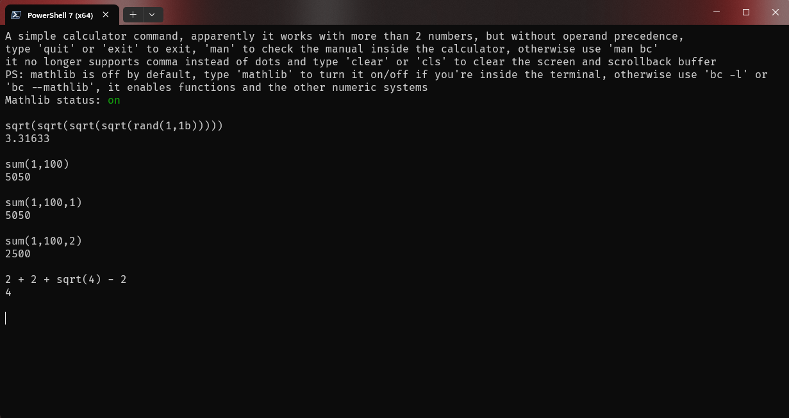
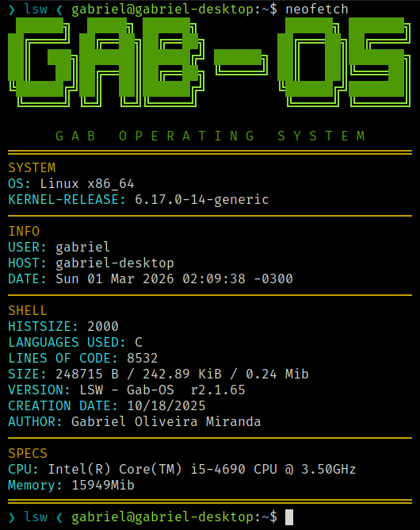

<div align="center">

<h3>LSW in action</h3>

<p>
  <br><br>
  
</p>

<p><em>Note: Images may be outdated as the project is under continuous development.</em></p>

</div>


<div align="center">

<h1>LSW — Linux Subsystem for Windows</h1>

<pre style="
font-size: 14px;
line-height: 1.1;
user-select: none;
">
 ██████╗  █████╗ ██████╗           ██████╗ ███████╗
██╔════╝ ██╔══██╗██╔══██╗         ██╔═══██╗██╔════╝
██║  ███╗███████║██████╔╝ ██████╗ ██║   ██║███████╗
██║   ██║██╔══██║██╔══██╗ ╚═════╝ ██║   ██║╚════██║
╚██████╔╝██║  ██║██████╔╝         ╚██████╔╝███████║
 ╚═════╝ ╚═╝  ╚═╝╚═════╝           ╚═════╝ ╚══════╝
</pre>

<p><em>Lightweight educational shell inspired by Linux</em></p>

</div>

**LSW** is a lightweight terminal environment written in C, inspired by Linux systems.  
It provides a custom shell with its own set of commands, behaviors and internal logic, designed for learning, experimentation and low-level programming practice.

Although originally focused on Windows, **LSW runs perfectly on both Windows and Linux**.  
It is expected to also work on macOS, but this platform has not yet been officially tested.

---

## Purpose

LSW was created mainly for:

- People who are starting to use Linux
- Students interested in operating systems concepts
- Developers who enjoy low-level programming
- Anyone who wants to explore how a shell works internally

The project focuses on simplicity, clarity and educational value.

---

## Features

- Custom shell implementation in C  
- Cross-platform support (Windows and Linux)
- Linux-inspired environment and behavior
- Own command system with custom logic
- Command history system
- Modular design for easy expansion
- Dynamic command history (you can define a limit in lswrc.txt)

---

## Built With

- **C language**
- **CMake** build system

---

## Supported Platforms

| Platform | Architecture | Status |
|---------|--------|--------|
| Windows | arm64 (aarch64) / amd64 (x86_64) | ✅ Fully supported |
| Linux   | arm64 (aarch64) / amd64 (x86_64) | ✅ Fully supported |
| Android | arm64 (aarch64) | ✅ Fully supported |
| macOS   | arm64 (aarch64) / amd64 (x86_64) | ⚠️ Untested |

---

## Dependencies

To build LSW, you need the following tools installed:

### Required

- **C compiler**
  - GCC or Clang on Linux
  - MinGW (GCC) or MSVC on Windows
- **CMake** (version 3.10 or newer)
- **Git**

### Optional (but recommended)

- **Make** or **Ninja** (used by CMake as build backend)

### Install Instructions

**Linux (Ubuntu / Debian)**

```bash
sudo apt update
sudo apt install build-essential cmake git
```

**Windows**

**Note:** these commands may not work on your computer (it works on mine), if it doesn't work you'll need to download these programs manually. (Git, Cmake and MSYS2 or MinGw)

```bash
winget install --id Git.Git -e
winget install --id Kitware.CMake -e
winget install --id MSYS2.MSYS2 -e

```

---

## Build & Run

**Note:** the `data/` folder must remain in the same directory as the executable.

### Linux

```bash
git clone https://github.com/gabk9/lsw-Gab-OS.git
cd lsw-Gab-OS
git checkout pc-linux
cmake .
cmake --build .
./lsw
```

### Windows (Powershell)

```bash
git clone https://github.com/gabk9/lsw-Gab-OS.git
cd lsw-Gab-OS
git checkout pc-linux
cmake .
cmake --build .
.\lsw.exe
```
